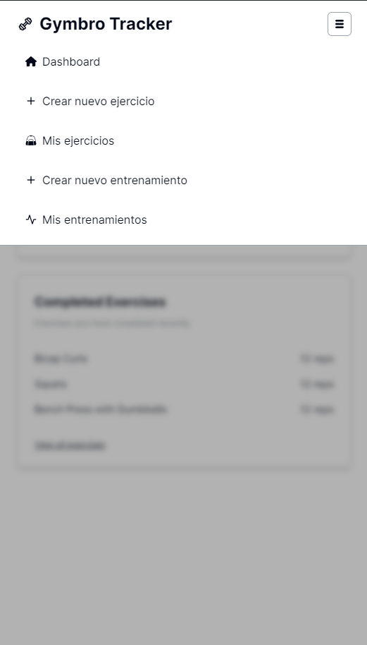
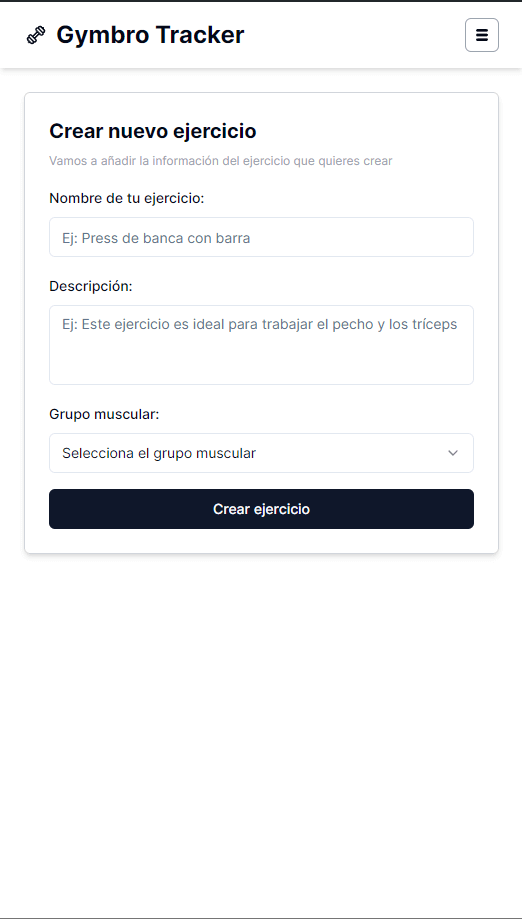
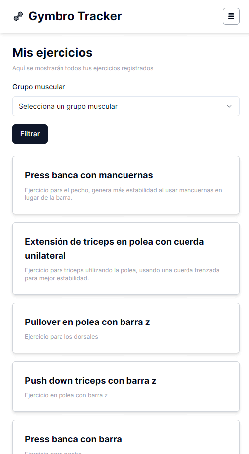
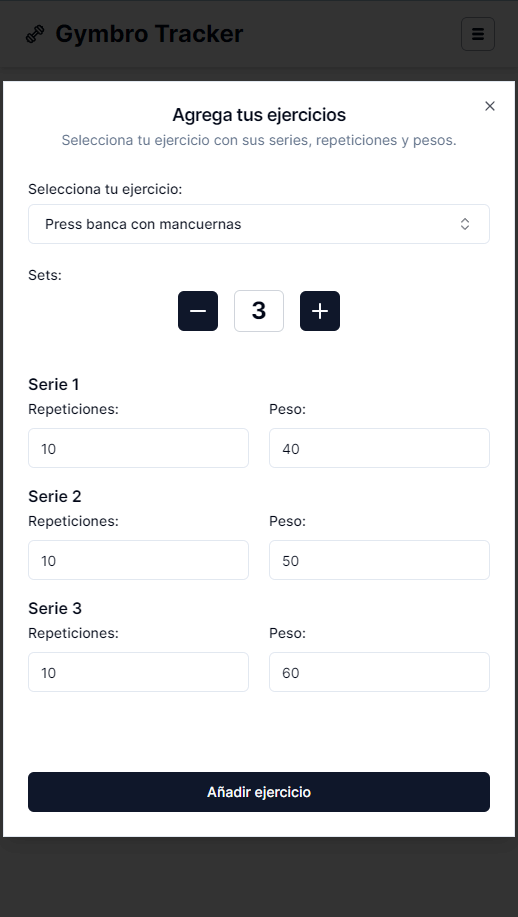
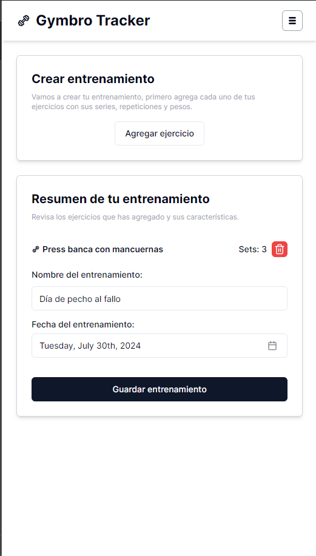
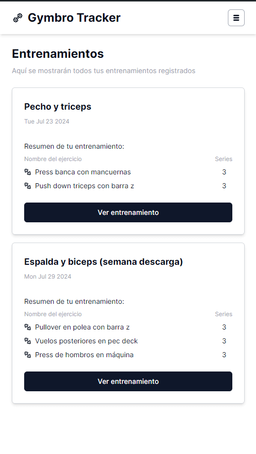

# Gymbro Tracker

It is a web application that allows you to track your workouts and progress.

## Getting Started

1. Clone the repository.
2. Create a copy of `.env.template` and rename to `.env` then change values of environment variables.
3. Intall dependencies `pnpm i`
4. Up database in docker `docker compose up -d`
5. Run project `pnpm run dev`

```bash
npm run dev
# or
yarn dev
# or
pnpm dev
# or
bun dev
```

## Screenshots

| Sidebar Menu                                                         | Create exercise                                                      | My exercises                                                         |
| -------------------------------------------------------------------- | -------------------------------------------------------------------- | -------------------------------------------------------------------- |
|  |  |  |

| Add exercise to workout                                              | Create workout                                                       | My workouts                                                          |
| -------------------------------------------------------------------- | -------------------------------------------------------------------- | -------------------------------------------------------------------- |
|  |  |  |
